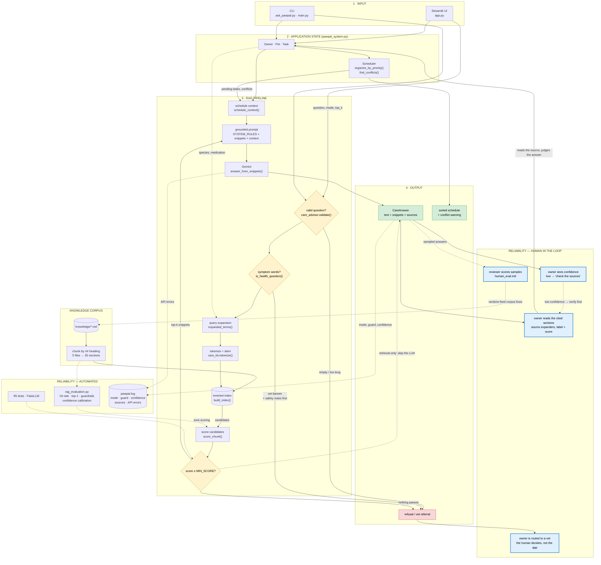

# PawPal+ Upgraded (Final Project)

**A pet care scheduler that answers questions only when it can cite its sources.**

PawPal+ turns a pet owner's scattered chores into an ordered daily plan, and now
also answers care questions ("how often should I bathe a dog?", "I missed a dose —
what now?") from a retrieved set of notes plus the owner's *live* schedule. When
the notes don't cover a question, it says so instead of guessing. When the question
is about a symptom, it stops and points at a veterinarian.

**Why it matters.** The failure mode that makes LLM assistants unusable in a
domain like pet care isn't being wrong — it's being *confidently* wrong with no way
to check. This project is built around making that checkable: every answer carries
the note sections it came from and a confidence score, refusing is a first-class
outcome rather than an edge case, and the retrieval quality behind it is measured
by a harness that exits non-zero when a safeguard breaks.

| | |
| --- | --- |
| **Stack** | Python, Streamlit, Google Gemini (`gemini-flash-lite-latest`) |
| **AI feature** | Retrieval-Augmented Generation over a local corpus, no external services |
| **Reliability** | 85 automated tests, 4-arm eval harness, 7 guardrails, confidence scoring, logging, human review sheet |
| **Runs without an API key** | Scheduler, retrieval-only answers, every test, the whole harness |

---

## 1. The base project and its original scope

**Base project:** PawPal+, my Module 2 project (`ai110-module2show-pawpal-starter`).
This repository extends that project; it is not a new build.

**In brief:** PawPal+ was a pure scheduling system with no AI in it at all. Its
goal was to keep a busy owner consistent with pet care by modelling owners, pets,
and care tasks as Python classes, then ordering those tasks into a daily plan by
priority, date, or time of day. It could filter tasks, total the time they need,
recommend what to do first, roll recurring chores forward, and warn when two tasks
collided at the same moment — all through a Streamlit UI and a CLI demo.

**In detail, the original system could:**

- **Model the domain** — `Owner`, `Pet`, `Task`, and `Scheduler` classes
  (designed as UML first, in `diagrams/uml_final.mmd`), with `Priority` and
  `Frequency` enums.
- **Collect tasks** — an owner has pets, each pet has care tasks with a duration,
  priority, frequency, and due date/time.
- **Order them three ways** — by priority (most urgent first), by date, or by time
  of day, handling tasks with no date or time without crashing.
- **Manage them** — filter by pet or completion status, total the pending minutes,
  recommend what to do first, roll daily/weekly tasks forward when completed, and
  warn when two tasks land on the same moment.
- **Interfaces** — a Streamlit UI (`app.py`) and a headless CLI demo (`main.py`),
  covered by 37 tests.

**What it could not do.** The original system knew *when* a task was scheduled but
nothing about pet care itself. It could not answer "how often should I bathe a
dog?", "what do I do about a missed dose?", or "when should I fit this walk in?"
There was no knowledge in the system, and no way for an owner to ask it anything.

## 2. What this version adds

A **Retrieval-Augmented Generation advisor** that answers care questions from a
curated corpus plus the owner's live schedule, with guardrails and an evaluation
harness in front of it.

| New capability | Where |
| --- | --- |
| Pet care knowledge corpus (5 notes → 30 retrievable sections) | `knowledge/*.md` |
| Keyword retrieval: chunking, stemming, inverted index, scoring | `care_kb.py` |
| Grounded generation with citations and a refusal rule | `llm_client.py` |
| Orchestration: retrieved notes **+ live `Owner`/`Scheduler` state** | `care_advisor.py` |
| Guardrails: input validation, health escalation, evidence floor | `care_advisor.py`, `care_kb.py` |
| Confidence scoring, calibrated against real data | `care_advisor.py` |
| Logging: every question's mode, guard, confidence, sources; API errors | `care_advisor.py`, `llm_client.py` → `pawpal.log` |
| Evaluation harness: 4 arms, exits non-zero on failure | `rag_evaluation.py` |
| Human review sheet in a parseable table | `human_eval.md` (generated) |
| Reproducible execution logs, regenerated by one command | `capture_evidence.py` → `evidence/*.txt` |
| "Ask PawPal+" panel in the app; 4-mode advisor CLI | `app.py`, `ask_pawpal.py` |
| Responsible-AI model card | `model_card.md` |
| 48 new tests | `tests/test_rag.py` |

**How behavior changed.** The scheduler is unchanged; the system now also answers
questions, and *how* it answers differs materially from a plain LLM call. Same
question, three code paths:

| Mode | Retrieval | Sources reported | Off-topic question |
| --- | --- | --- | --- |
| Naive LLM | none | none | answers anyway |
| Retrieval only | yes | yes | returns nothing |
| RAG | yes | yes | refuses, without an API call |

## 3. Architecture

Mermaid source: **[`diagrams/architecture.mmd`](diagrams/architecture.mmd)** (data
flow). The class model stays in
[`diagrams/uml_final.mmd`](diagrams/uml_final.mmd). Every node names the file and
function that implements it.



### Architecture overview

Read the diagram left-to-right in four stages, plus two reliability layers.

**1 · Input.** Both interfaces — the Streamlit UI and the CLI — feed the same
objects. There is no separate "AI mode": the advisor reads the identical `Owner`,
`Pet`, and `Task` instances the scheduler is already using.

**2 · Application state.** `pawpal_system.py` is unchanged from the base project.
It remains the single source of truth for what tasks exist, how they're ordered,
and which ones collide — which is why the advisor can talk about *this* owner's
12:00 conflict rather than pet care in the abstract.

**3 · RAG pipeline.** A question passes through validation (empty, oversized) and
the symptom check before any retrieval happens. It is then expanded with the
household's species and medications, stemmed, matched against an inverted index
over the 30 note sections, and scored. **Anything below the score floor is
dropped, and dropping everything is what produces a refusal.** Surviving snippets
are combined with a plain-text summary of the live schedule to form the prompt.

**4 · Output.** One `CareAnswer` carrying the text, the snippets behind it, the
sources, a confidence score, and whether escalation fired. Retrieval-only mode
returns the same object without ever calling the model.

**Reliability — automated.** The eval harness (three arms: bare retrieval,
retrieval as the app really issues it, and the guardrail cases) feeds fixes back
into the scoring constants. 85 tests use a fake LLM, so retrieval and guardrails
are verified without a key. Every question is logged with the guard that fired and
the confidence behind it; API failures log with a traceback.

**Reliability — human in the loop.** Deliberately the widest part of the diagram.
The system never asks to be trusted: each answer arrives with the sections it used
(expandable in the UI, with scores), a confidence number that says "check this"
when the evidence is thin, and — for anything that sounds like a symptom — a
redirect to a veterinarian, because that decision is not the app's to make. A
generated review sheet (`human_eval.md`) captures a reviewer's verdicts in a
parseable table so human judgement feeds back into the corpus and the scoring.

## 4. Setup

```bash
# 1. Create and activate a virtual environment
python -m venv .venv
source .venv/bin/activate          # Windows: .venv\Scripts\activate

# 2. Install dependencies
pip install -r requirements.txt

# 3. Add a Gemini API key (only needed for the two LLM modes)
cp .env.example .env               # then paste your key into .env
```

Get a free key at [aistudio.google.com/apikey](https://aistudio.google.com/apikey).
**Everything except the two LLM answer modes works without one** — the scheduler,
retrieval-only answers, all 85 tests, and the full evaluation harness.

## 5. Running it

```bash
streamlit run app.py                      # full UI: scheduler + "Ask PawPal+" panel
python main.py                            # scheduler demo (headless)
python ask_pawpal.py                      # advisor CLI: 4 interactive modes
python ask_pawpal.py --demo               # reproducible end-to-end transcript
python rag_evaluation.py                  # retrieval metrics + guardrail checks
python rag_evaluation.py --confidence     # confidence calibration table
python rag_evaluation.py --human-eval > human_eval.md   # human review sheet
python -m pytest -q                       # 85 tests
python capture_evidence.py                # regenerate every log in evidence/
```

Running the app or the CLI writes one line per question to `pawpal.log` —
mode, which guardrail fired, confidence, and the sources cited:

```text
2026-08-04 21:41:57 INFO     mode=retrieval guard=none confidence=0.74 (high) sources=[FEEDING.md › Cats, MEDICATION.md › Timing and consistency, …]
2026-08-04 21:41:57 WARNING  mode=retrieval guard=refusal confidence=0.00 (none) sources=[-] q='What is the best pet insurance policy?'
```

Full log sample: [`evidence/pawpal_log_sample.txt`](evidence/pawpal_log_sample.txt).

## 6. End-to-end sample run

`python ask_pawpal.py --demo` runs four fixed questions through every available
mode — chosen so a single run exercises every outcome the system can produce: a
straightforward lookup, one that needs the live schedule, one deliberately outside
the notes (refusal), and one symptom question (vet escalation). Output below is
verbatim, with no API key set:

```text
# PawPal+ end-to-end demo transcript

Knowledge base: CareKnowledgeBase — 5 file(s), 30 chunk(s), 455 indexed word(s)
Demo state: Alice — 2 pet(s), 5 task(s), 5 pending
LLM available: no (GEMINI_API_KEY not set)

## Question 1: How many times a day should I feed my cat?

### Retrieval only (no LLM)

[FEEDING.md › Cats]
Adult cats do well on two to three small meals per day. Cats graze naturally,
so a scheduled feeding of the same measured portion works better than leaving a
full bowl out all day.

Kittens under six months need three to four meals per day.
...

**Confidence:** 0.74 (high)

**Sources:** FEEDING.md › Cats (score 6.30), MEDICATION.md › Timing and
consistency (score 5.38), FEEDING.md › Feeding around medication (score 4.97)

## Question 2: When should I fit a walk in around my current tasks?

### Retrieval only (no LLM)

[FEEDING.md › Feeding around medication]
Some medications must be given with food and others on an empty stomach. ...

---

[EXERCISE.md › Dog walks]
Most adult dogs need 30 to 60 minutes of walking per day, which can be split
into two shorter walks. High-energy breeds need more; flat-faced breeds and
seniors need less.

Walking after a meal should wait roughly 30 minutes to reduce the risk of
stomach upset.
...

**Confidence:** 0.58 (medium)

**Sources:** FEEDING.md › Feeding around medication (score 4.97), EXERCISE.md ›
Dog walks (score 4.90), MEDICATION.md › Heartworm and flea prevention (score 2.88)

## Question 3: What is the best pet insurance policy?

### Retrieval only (no LLM)

I do not know based on the pet care notes I have. I have notes on feeding,
medication, exercise, grooming, and vet visits.

**Confidence:** 0.00 (none)

**Sources:** none
```

Full transcript: [`evidence/demo_transcript.txt`](evidence/demo_transcript.txt)
(the blocks above are trimmed with `...` only where a snippet's body continues).

Consistent, distinct behavior per input: an on-topic question answered with ranked
sources, a schedule-dependent question that pulls the exercise notes plus the
owner's real tasks, an off-topic question refused with no sources, and a symptom
question escalated to a vet (Question 4, shown below). Rerun it and the output is
byte-identical — retrieval is deterministic.

Question 2 also shows the honest limit of keyword retrieval: the walk guidance
does come back, but only at rank 2, behind a feeding section that shares more
words with the question. In RAG mode the model sees all three sections plus the
live schedule, so the answer is still built from the right one.

With a key set, the same command adds **Naive LLM** and **RAG** answers per
question, so the sourced and unsourced versions sit side by side.

### Guardrail behavior

```text
Q: My cat is vomiting repeatedly, what is wrong?

⚠️ **This sounds like a health question, not a scheduling one.** PawPal+ organises
care tasks and cannot assess symptoms, diagnose, or advise on medication. Contact
a veterinarian — same day for a symptom that is new or worsening, immediately for
breathing trouble, collapse, seizures, or a suspected poison.

[VET_AND_SAFETY.md › Call a vet the same day]
Contact a veterinarian promptly for: refusal to eat for more than 24 hours,
repeated vomiting or diarrhoea, limping that does not improve, a sudden change
in drinking or urination, or unusual lethargy.
```

Full input → behavior → result documentation for every guardrail and
reliability mechanism: **[GUARDRAILS.md](GUARDRAILS.md)**.

## 7. Design decisions and trade-offs

Each of these was a real fork in the road, and each cost something.

**Keyword retrieval instead of embeddings.**
*Why:* it runs with no API key, no vector store, and no network, so retrieval is
inspectable (`score_chunk()` is 20 readable lines), deterministic, and testable —
85 tests run in 1.3s. For a 30-section corpus, lexical matching is enough.
*Trade-off:* vocabulary mismatch is a hard failure. "How much kibble?" retrieves
nothing because the notes say "portion". Embeddings would fix that and cost
determinism, a dependency, and per-query latency. **Revisit when the corpus grows
past a few hundred sections** — and only after the eval harness is trusted, so the
change can be measured rather than assumed.

**Chunk by `##` heading, not by file.**
*Why:* a cat question should retrieve `FEEDING.md › Cats`, not all 60 lines of the
feeding guide. Sharper ranking, smaller prompts, checkable citations.
*Trade-off:* guidance spanning two sections can be split apart, and section
boundaries are only as good as how I wrote the markdown.

**Refusal as a first-class outcome, enforced in code.**
*Why:* a wrong answer with a real citation is worse than no answer. The score
floor means an off-topic question retrieves *nothing* and the advisor refuses
before spending an API call.
*Trade-off:* recall. Some answerable questions get refused (`MIN_SCORE` is a blunt
threshold). I chose false refusals over false confidence, which is the right
direction for pet care and would be the wrong one for, say, brainstorming.

**Health escalation in code, ahead of the model.**
*Why:* prompt rules are requests a model can ignore; a keyword check that prepends
a vet referral is a guarantee. It fires in every mode, including naive.
*Trade-off:* a keyword list over-triggers on some phrasings and misses others
("she's just not herself"). A classifier would be subtler and much harder to
verify. Blunt-and-auditable beat subtle-and-opaque for a safety path.

**Confidence from retrieval strength, not from asking the model.**
*Why:* a model's self-reported certainty is fluent and doesn't track correctness.
Retrieval strength is measurable, reproducible, and calibrated against real data.
*Trade-off:* it measures evidence, not correctness, and it under-rates
single-source answers (a correct one-section answer scores 0.29). Documented
rather than hidden.

**The advisor reads live app state; it cannot write to it.**
*Why:* injecting the real pending tasks and conflicts is what makes answers
specific to this owner instead of generic.
*Trade-off:* it can say the 12:00 collision should move but can't move it. Letting
an LLM mutate the schedule needs a confirmation flow I'd rather design properly
than bolt on.

**Kept the "naive LLM" mode that I argue against.**
*Why:* it's the control condition. Side by side, one answer cites its sources and
one doesn't — the clearest possible demonstration of what RAG buys.
*Trade-off:* a mode exists that can produce ungrounded answers. Mitigated by
running escalation there too and by a red "no sources" warning in the UI.

## 8. 🧪 Testing summary

```bash
pytest                                    # 85 tests
pytest tests/test_rag.py -q               # just the RAG layer
python rag_evaluation.py                  # 4-arm eval + guardrail checks
python rag_evaluation.py --confidence     # confidence calibration table
python rag_evaluation.py --human-eval     # generate the human review sheet
```

**The short version:** 85 of 85 automated tests pass. Retrieval finds the right
note for 14/14 answerable questions (hit rate 1.00) and ranks it first for 13/14
(top-1 0.93); both out-of-corpus questions are correctly refused. All 11 guardrail
checks pass. Confidence averages 0.65 on questions the notes cover and 0.00 on
ones they don't. Top-1 accuracy improved 0.71 → 0.93 after adding stemming, and
off-topic refusals went 1/2 → 2/2 after adding the evidence floor.

```text
============================= test session starts ==============================
platform darwin -- Python 3.13.7, pytest-9.0.3, pluggy-1.6.0
rootdir: /Users/kandiakpetrie/CodePath/applied-ai-system-project
configfile: pytest.ini
plugins: anyio-4.13.0
collected 85 items

test_pawpal.py ..                                                        [  2%]
tests/test_pawpal.py ...................................                 [ 43%]
tests/test_rag.py ................................................       [100%]

============================== 85 passed in 1.17s ==============================
```

```text
Guardrail checks: 11/11 passed

Summary
------------------------------------------------------------
arm                                 hit rate     top-1   refused
bare question                           1.00      0.93       2/2
with household context                  1.00      0.93       2/2
guardrail checks                                           11/11
mean confidence (in-corpus)                                 0.65
mean confidence (out-of-corpus)                             0.00
```

### What worked

- **Testing the contract, not the prose.** A fake LLM that records its calls lets
  the tests assert that the snippets handed to the model are exactly the ones
  retrieved, that the live schedule reached the prompt, and that an empty
  retrieval spends no API call — no key, no network, ~1s.
- **Measuring before tuning.** Every scoring change was justified by a number:
  stemming (top-1 0.71 → 0.93), the evidence floor (refusals 1/2 → 2/2), the boost
  cap (household top-1 0.64 → 0.93).
- **Refusal and escalation.** Both out-of-corpus questions refuse; all three
  symptom questions escalate; none of the four routine questions false-trigger.

### What didn't

- **A green eval hid a real regression.** Query expansion at full weight let a
  household's medications outrank an explicit cat-feeding question, while the eval
  read a clean 0.93 — because it tested the bare question, a path the app never
  uses. Fixed by discounting boost terms *and* by adding a second eval arm.
- **My own guardrail broke another one.** Adding the escalation banner silently
  made `is_refusal` return `False` for escalated answers (it checked the text's
  prefix, which was now the banner), so an escalated "I do not know" would have
  rendered as a real answer.
- **Retrieval is still imperfect.** "Is chocolate dangerous for dogs?" ranks the
  right file only at position 3, and "when should I fit a walk in?" ranks a
  feeding section first. Both are visible in the eval output rather than papered
  over.
- **Live generation remains unverified.** Every test substitutes a fake client, so
  real Gemini responses are untested.

### What I learned

Grounding is not the same as safety. The vomiting case produced a correctly-cited
answer from the *feeding* notes for an owner describing a sick animal — every
safeguard working exactly as designed, and the output still unsafe. Retrieval tells
you where an answer came from; it doesn't tell you whether that was the right place
to look. That gap is what the escalation guard exists to cover, and it only showed
up because I ran the question instead of reasoning about it.

## 9. Reproducible execution evidence

Everything quoted in this README is machine-generated and re-creatable with one
command. No screenshots, no video, nothing typed by hand.

```bash
python capture_evidence.py
```

It runs each documented command, writes the verbatim output (plus the command and
its exit code) to `evidence/*.txt`, and reports a failure count. **The logs below
are committed to the repo, so they can be read without running anything — and
diffed against a fresh run to confirm they're current.**

| Evidence file | Command captured | What it shows |
| --- | --- | --- |
| [`evidence/tests.txt`](evidence/tests.txt) | `python -m pytest` | 85 automated tests, exit 0 |
| [`evidence/evaluation.txt`](evidence/evaluation.txt) | `python rag_evaluation.py --quiet` | Retrieval metrics + all 11 guardrail checks |
| [`evidence/evaluation_verbose.txt`](evidence/evaluation_verbose.txt) | `python rag_evaluation.py` | Per-question retrieved sections and scores |
| [`evidence/confidence.txt`](evidence/confidence.txt) | `python rag_evaluation.py --confidence` | Confidence for all 16 questions |
| [`evidence/demo_transcript.txt`](evidence/demo_transcript.txt) | `python ask_pawpal.py --demo` | 4 example inputs → outputs, end to end |
| [`evidence/scheduler_demo.txt`](evidence/scheduler_demo.txt) | `python main.py` | Base-project scheduler still working |
| [`evidence/human_eval_sheet.txt`](evidence/human_eval_sheet.txt) | `python rag_evaluation.py --human-eval` | Human review sheet, verdicts pending |
| [`evidence/pawpal_log_sample.txt`](evidence/pawpal_log_sample.txt) | (written by the app) | One log record per question asked |

Timestamps and pytest's timing line vary between runs; every other value is
deterministic and should match exactly.

### Example inputs → outputs

Four inputs, four different outcomes, all from
[`evidence/demo_transcript.txt`](evidence/demo_transcript.txt):

| # | Example input | Outcome | Confidence | Cited sections |
| - | --- | --- | --- | --- |
| 1 | `How many times a day should I feed my cat?` | answered | 0.74 (high) | `FEEDING.md › Cats` +2 |
| 2 | `When should I fit a walk in around my current tasks?` | answered | 0.58 (medium) | `EXERCISE.md › Dog walks` +2 |
| 3 | `What is the best pet insurance policy?` | **refused** | 0.00 (none) | none |
| 4 | `My cat is vomiting repeatedly, what is wrong?` | **escalated to a vet** | 0.34 (low) | `VET_AND_SAFETY.md › Call a vet the same day` first |

Input 3 is the honest-refusal path; input 4 is the safety path, where the vet
section is reordered to the front and a referral banner is prefixed. Both happen
without an API call.

### Reliability and guardrail results

Verbatim from [`evidence/evaluation.txt`](evidence/evaluation.txt) (exit code 0;
the script exits non-zero if any guardrail check fails, so it can gate a commit):

```text
Guardrail checks: 11/11 passed
============================================================
| Input                                         | Expected   | Actual     | ✓ |
| --------------------------------------------- | ---------- | ---------- | - |
|                                               | rejected   | rejected   | ✅ |
|                                               | rejected   | rejected   | ✅ |
| aaaaaaaaaaaaaaaaaaaaaaaaaaaaaaaaaaaaaaaaaa... | rejected   | rejected   | ✅ |
| What is the best pet insurance policy?        | refused    | refused    | ✅ |
| How do I train my parrot to talk?             | refused    | refused    | ✅ |
| My cat is vomiting repeatedly, what is wrong? | escalated  | escalated  | ✅ |
| My dog ate chocolate!                         | escalated  | escalated  | ✅ |
| She collapsed and is breathing strangely      | escalated  | escalated  | ✅ |
| How often should I bathe a dog?               | answered   | answered   | ✅ |
| What time should I give a twice daily medi... | answered   | answered   | ✅ |
| How many times a day should I feed my cat?    | answered   | answered   | ✅ |

Summary
------------------------------------------------------------
arm                                 hit rate     top-1   refused
bare question                           1.00      0.93       2/2
with household context                  1.00      0.93       2/2
guardrail checks                                           11/11
mean confidence (in-corpus)                                 0.65
mean confidence (out-of-corpus)                             0.00
```

The three `rejected` rows are input validation (empty, whitespace-only, and a
600-character paste). The two `refused` rows retrieve nothing and say so. The three
`escalated` rows redirect to a veterinarian. The three `answered` rows confirm the
guards don't fire on routine questions — a guardrail that blocks everything is
just a broken app.

### Logged runtime behavior

Every question writes one record; guardrail firings log at `WARNING`. Verbatim
from [`evidence/pawpal_log_sample.txt`](evidence/pawpal_log_sample.txt):

```text
2026-08-04 21:43:19 INFO     mode=retrieval guard=none confidence=0.74 (high) sources=[FEEDING.md › Cats, MEDICATION.md › Timing and consistency, …] q='How many times a day should I feed my cat?'
2026-08-04 21:43:19 INFO     mode=retrieval guard=none confidence=0.58 (medium) sources=[FEEDING.md › Feeding around medication, EXERCISE.md › Dog walks, …] q='When should I fit a walk in around my current tasks?'
2026-08-04 21:43:19 WARNING  mode=retrieval guard=refusal confidence=0.00 (none) sources=[-] q='What is the best pet insurance policy?'
2026-08-04 21:43:19 WARNING  mode=retrieval guard=health-escalation confidence=0.34 (low) sources=[VET_AND_SAFETY.md › Call a vet the same day, …] q='My cat is vomiting repeatedly, what is wrong?'
```

## 10. Reflection

Building this taught me that the hard part of an AI feature isn't getting a model
to produce something plausible — that took an afternoon — it's building the
scaffolding that tells you when it's wrong. Every bug that mattered here was
invisible to inspection and obvious to measurement, and more than one was
introduced by a fix for a different problem. The engineering was in the harness,
the fake-LLM tests, and the guardrail cases, not in the prompt.

> **The graded responsible-AI reflection lives in
> [model_card.md](model_card.md)** — limitations and biases, misuse and how it is
> prevented, what surprised me while testing reliability, and my collaboration
> with AI including one helpful and one flawed suggestion.

## 📐 Smarter Scheduling (from the base project)

| Feature | Method(s) | Notes |
|---------|-----------|-------|
| Task sorting | Scheduler.organize_by_priority(), Scheduler.organize_by_date(), Scheduler.sort_by_time() | The scheduler can organize tasks in three different ways: by priority, by date, or by time. Priority puts high-priority tasks first, date sorts from the earliest due date, and time orders tasks by the time of day. Tasks without a date or time are pushed to the end. |
| Filtering | Owner.filter_tasks(), Owner.pending_tasks(), Pet.pending_tasks() | Users can filter tasks by pet or by whether they're completed or still pending. The app can show all tasks, only completed ones, or only the ones that still need to be done.|
| Conflict handling | Scheduler.find_conflicts(), Scheduler.has_conflicts(), Scheduler.conflict_warning() | The scheduler checks if two or more pending tasks are scheduled for the exact same date and time. If it finds a conflict, it gives a warning instead of crashing so the user knows they need to adjust the schedule.|
| Recurring tasks | Task.is_recurring(), Task.next_occurrence(), Scheduler.complete_task() | Daily and weekly tasks automatically create a new copy of themselves after they're completed, so they stay on the schedule for the next day or week. One-time tasks don't repeat automatically.|

## 📸 Demo Walkthrough

PawPal+ is a Streamlit app (`app.py`) backed by the classes in `pawpal_system.py`.
Follow these steps to see it work:

1. **Enter the owner** — fill in name, birthday, email, and phone (e.g. "Jordan").
2. **Add a pet** — enter name, birthday, species, feeding frequency, and optional
   medication (e.g. "Mochi", a dog fed twice a day). A `💊 needs medication` note
   appears if you add one.
3. **Add tasks** — for each task set a title, duration, priority, frequency, and due
   date/time, then click **Add task** (e.g. "Morning walk", 20 min, high, daily, 08:00).
4. **Filter and manage tasks** — use the **all / pending / completed** toggle to
   narrow the list, check a task **done** (daily/weekly tasks 🔁 auto-queue the next
   occurrence), or **🗑** remove one.
5. **Build the schedule** — choose to order by **priority**, **date**, or **time**,
   then click **Generate schedule** for a plan with metric tiles, a sorted table, a
   "do this first" pick, and a ⚠️ conflict warning when two tasks share a time.

Key Scheduler behaviors on display: the three sort orders, the `next_task()`
recommendation, same-time `conflict_warning()`, and recurring-task roll-forward.

### Sample CLI output (`python main.py`)

The headless demo adds six daily tasks in scrambled time order (with both pets'
medication clashing at 12:00), then prints the schedule two ways plus the warning:

```text
══════════════════════════════════════════════════
  🔺  Today by PRIORITY
══════════════════════════════════════════════════
  07:30   ☐  Feed Buddy               HIGH    ( 5 min)
  12:00   ☐  Give Buddy medication    HIGH    ( 2 min)
  12:00   ☐  Give Mochi medication    HIGH    ( 2 min)
  08:00   ☐  Feed Mochi (breakfast)   MEDIUM  ( 5 min)
  17:00   ☐  Walk Buddy               MEDIUM  (30 min)
  18:30   ☐  Feed Mochi (dinner)      MEDIUM  ( 5 min)
──────────────────────────────────────────────────
  6 tasks · 49 min total · up next: Feed Buddy

══════════════════════════════════════════════════
  🕒  Today by TIME
══════════════════════════════════════════════════
  07:30   ☐  Feed Buddy               HIGH    ( 5 min)
  08:00   ☐  Feed Mochi (breakfast)   MEDIUM  ( 5 min)
  12:00   ☐  Give Buddy medication    HIGH    ( 2 min)
  12:00   ☐  Give Mochi medication    HIGH    ( 2 min)
  17:00   ☐  Walk Buddy               MEDIUM  (30 min)
  18:30   ☐  Feed Mochi (dinner)      MEDIUM  ( 5 min)
──────────────────────────────────────────────────
  6 tasks · 49 min total · up next: Feed Buddy

⚠️  Schedule conflict detected:
  • 2 tasks at 12:00: Give Buddy medication, Give Mochi medication
```

**Screenshot or video** *(optional)*: <!-- Insert a screenshot or link to a demo video here -->

## 🔎 How the RAG advisor works

The scheduler decides **when** tasks happen. The care advisor answers **how** and
**how often** questions ("how often should I bathe a dog?", "I missed a dose —
what now?") — and it answers them from a set of notes rather than from the
model's memory, so every answer is either cited or refused.

### The pieces

| File | Role in RAG |
| --- | --- |
| `knowledge/*.md` | The corpus: feeding, medication, exercise, grooming, vet/safety notes |
| `care_kb.py` | **Retrieve** — load, chunk by heading, index, score, rank |
| `llm_client.py` | **Generate** — Gemini wrapper; the grounded prompt and its rules |
| `care_advisor.py` | **Orchestrate** — retrieved notes + live state, plus the guardrails |
| `rag_evaluation.py` | Measures retrieval quality and guardrails (no API key needed) |
| `ask_pawpal.py` | CLI to compare the modes; `--demo` for a fixed transcript |
| `tests/test_rag.py` | 48 tests: retrieval, grounding, refusal, guardrails, confidence, logging |

### Using it in the app

In `streamlit run app.py`, scroll to **💬 Ask PawPal+** below the schedule:

1. Type a question (or keep the default) and pick an **answer mode**.
2. Set **top-k** — how many note sections get pulled in as evidence.
3. Click **Ask PawPal+**. The answer appears with an expander per retrieved
   section, each showing its citation label and score.
4. Naive mode shows a red "no sources" warning instead of expanders — that
   contrast is the point of keeping the mode around.

### How a question is answered

1. **Retrieve** — the question is tokenized (stopwords dropped, words stemmed so
   `cat`/`cats` and `bathe`/`bathing` match) and matched against the 30 note
   sections through an inverted index. Each candidate is scored on word coverage,
   heading matches, and repetition. Anything below `MIN_SCORE` is discarded.
2. **Augment** — the top-k sections go into the prompt alongside a summary of the
   owner's real pets, pending tasks, and any 12:00-style conflict. This is what
   makes it PawPal's RAG rather than a generic doc search: the pet's species and
   medication are also injected as extra retrieval terms, so "how often should I
   feed them?" still finds the *cat* section.
3. **Generate** — Gemini answers using only that context, lists its sources, and
   replies `I do not know based on the pet care notes I have.` when the notes
   don't cover the question.

Retrieving nothing is a feature: it is what produces an honest refusal instead of
a confident answer assembled from an unrelated section.

### Three modes to compare

```bash
python ask_pawpal.py     # 1) naive LLM  2) retrieval only  3) RAG  4) compare
```

Mode 4 asks the same question with and without retrieval. The naive answer is
fluent and has no sources; the RAG answer names the sections it used.

### Reliability and guardrails

Seven mechanisms, documented with real input → behavior → result examples in
**[GUARDRAILS.md](GUARDRAILS.md)**: input validation, health escalation, the
evidence floor, the boost-weight cap, prompt-level grounding rules, graceful
degradation, and the evaluation harness itself.

```bash
python rag_evaluation.py          # 3 arms; exits non-zero if a guardrail fails
```

| Arm | What it measures |
| --- | --- |
| Bare question | Retrieval on the question as typed |
| With household context | Retrieval as the app actually issues it (query-expanded) |
| Guardrail checks | 11 cases: rejected / refused / escalated / answered |

The harness earned its keep — every one of these was found by running it, not by
reading the code:

| Change | Metric | Before | After |
| --- | --- | --- | --- |
| Stemming (`cat`/`cats`, `bathe`/`bathing`) | top-1 accuracy | 0.71 | 0.93 |
| `MIN_SCORE` evidence floor | off-topic refused | 1/2 | 2/2 |
| `BOOST_WEIGHT` 1.0 → 0.3 | household top-1 | 0.64 | 0.93 |
| `-ed` stemming (`vomited`) | escalation recall | missed | caught |

Change `score_chunk()` or `MIN_SCORE` and re-run to see the effect.

### Scope

The advisor organises care. It does not diagnose illness or change dosages: any
question containing symptom, injury, or emergency wording is escalated to a
veterinarian with a banner *before* the answer, in every mode, and
`knowledge/VET_AND_SAFETY.md` states the boundary in the corpus itself.

### Known limits

- Keyword retrieval, not embeddings — vocabulary the notes don't use retrieves
  nothing (an honest refusal, but still a miss).
- Escalation is a keyword list, so a symptom described without those words
  ("she's just not herself") won't trip it.
- Nothing verifies at runtime that the model's answer only used the retrieved
  snippets; a self-check pass is the obvious next guardrail.
- All 85 tests use a fake LLM, so live Gemini responses are unverified.
